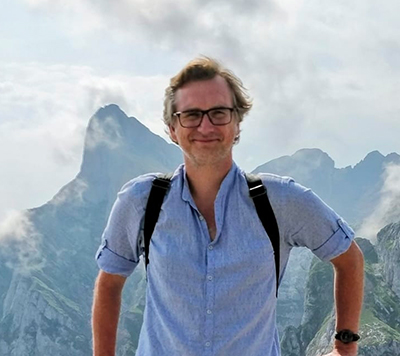

# Index

## Summary

As an experienced Web2 builder, I’m equally comfortable managing tech teams and collaborating with others on design and strategies, discussing solutions with stakeholders, and deploying products. I’m seeking out a role where my experience and existing skills can make a direct contribution as quickly, but also provide me with new challenges to continue to grow as a developer and a leader. I want to take the opportunity to contribute to building Web3.

## Experience

#### Webedia Group | CTO

**feb. 2019 - today · Madrid, Spain + Remote**

* Lead remote tech team (PMs and developpers) across the world : France, Serbia, Brazil, Germany
* Develop the new Web3 agency projects : NFT minting platform and more to come
* Analyze and develop procedures for management and technical duties
* Manage budget and staff allocation for each project
* Maintain project time frames, budget estimates and status reports
* Code review
* Web performance monitoring
* Ads and audience growth through optimization and SEO

#### Webedia Group | Technical Project Manager

**jan. 2014 - feb. 2019 · Paris, France**

* Lead remote developpers across the world : France, Serbia, Brazil
* Maintain project time frames, budget estimates and status reports
* Develop high-traffic websites
* Evolution of our inhouse PHP framework
* Code review
* Web performance monitoring

#### Webedia Group | **Web Developer**

**apr. 2012 - jan. 2014 · Paris, France**

* Develop and maintain internal tools in the research and development team
* Develop and maintain high-traffic websites
* Evolution of our inhouse PHP framework

#### Masao | CTO

**may 2010 - apr. 2012 · Paris, France**

* Lead developpers team remotely for the creation of websites for the company and its customers
* Setup methodology and process of the development team
* Configuration of our hosting platform Websites development on Open Source platform (Drupal & Wordpress)
* Interface with an off-shore web development company in Ukraine
* Interface with freelances
* Functional and technical specs writing

#### Carburant | Web Developer

**jul. 2009 - may 2010 · Paris, France**

* Development of websites and contests for Gaming industry : Sega, Ubisoft, Microsoft, Electronic Arts, Capcom, Bethesda
* Development of Facebook applications : SIMS, EA

#### **Webseven | Web Developer**

**sep. 2008 - may 2009 · Paris, France**

* Website development for multiple customers
* Functional and technical specs writing

#### XUL Comunicación Social **| Web Developer**

**oct. 2004 - jun. 2008 · Córdoba, Spain**

* Website development for multiple customers
* Development of a cross-country platform for ONU
* Development of accessibility focus website

#### Domainoo | Web Developer

**mar. 2001 - mar. 2002 · Paris, France**

* Development of a domain names marketplace for public and companies

#### H3D | Web Developer

**sept. 2000 - mars 2001 · Paris, France**

* Website development for multiple customers
* Hardware maintenance

## Skills

#### **Development**

HTML, CSS, JavaScript, PHP, MySQL, Docker, WAI-ARIA, Responsive Design, REST, MVC

Learning Solidity at the moment

#### Tools

Git, NPM, Composer, Yarn, WebPack, Gulp, Grunt, Vagrant

#### **Frameworks and Libraries**

jQuery, Blade, Bootstrap, Laravel, Zend Framework, WordPress, Google Maps API

#### **DevOps**

Cloudflare, Gitlab CI, Github, JIRA, Pingdom, Debugbear, Google Cloud, Linux

#### **Blockchains**

Understanding of Crypto & the Blockchain Platforms

Daily user of DeFi protocols (Balancer, Curve, QIDAO, Aave...)

## Education

#### University of Toulon | Bachelor of Multimedia

**1998 - 2000 · Saint Raphaël, France**

## Languages

**French**: native language

**Spanish**: bilingual (C2), living in Spain for 14 years

**English**: fluent (C1+)

## Hobbies

* Spend time with my kids
* Aavegotchi : member of the guild "The Gotchi French Army"
* Try out new protocols
